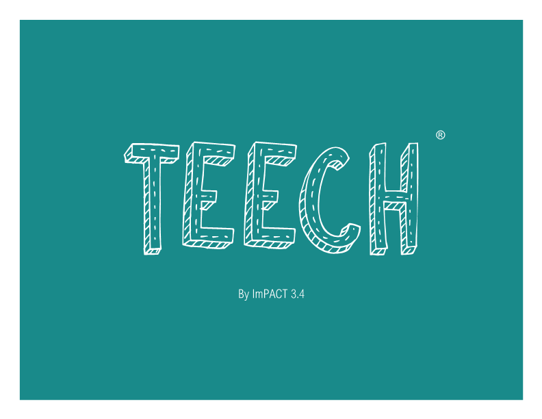
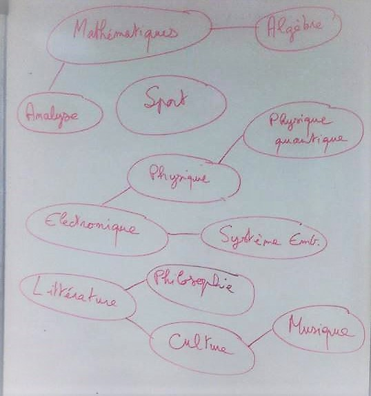

=== Fiche d’identité du groupe

===== Qui sommes nous ? 
Le groupe 3.4, six étudiants de Télécom ParisTech réunis par le projet PACT : Maxime Tchibozo, Louison Braun, Amyn Kassara, Jean Vassoyan, 
Arthur Ndoko et Maxime Lhoustau. Ce projet nous a poussé à faire émerger les synergies au sein de notre équipe formée par des profils hétéroclites.
En effet, nous sommes issus d'IUT et de différentes filières de prépas (MP, PSI) de différentes villes. Nous avons donc du établir les 
complémentarités dans un riche bouquet de compétences et de savoir-faire. Néanmoins, nous sommes mus par le même
désir d'apprendre et de sortir de notre zone de confort au cours de ce projet. De plus, nos intérêts convergent, ainsi
nous partageons un réel attrait pour les mathématiques, la physique, l'informatique mais également pour les humanités telles que la philosophie ou la littérature.
En somme, nous voulions que projet puisse être véritablement utile et qu'il apporte une réel plus-value aux utilisateurs.
Il nous est donc apparu, comme une évidence, que notre projet devrait permettre de partager des savoirs et des connaissances, et favoriser l'entraide. 
C'est ainsi que nous avons imaginé le projet TEECH que nous portons aujourd'hui.

