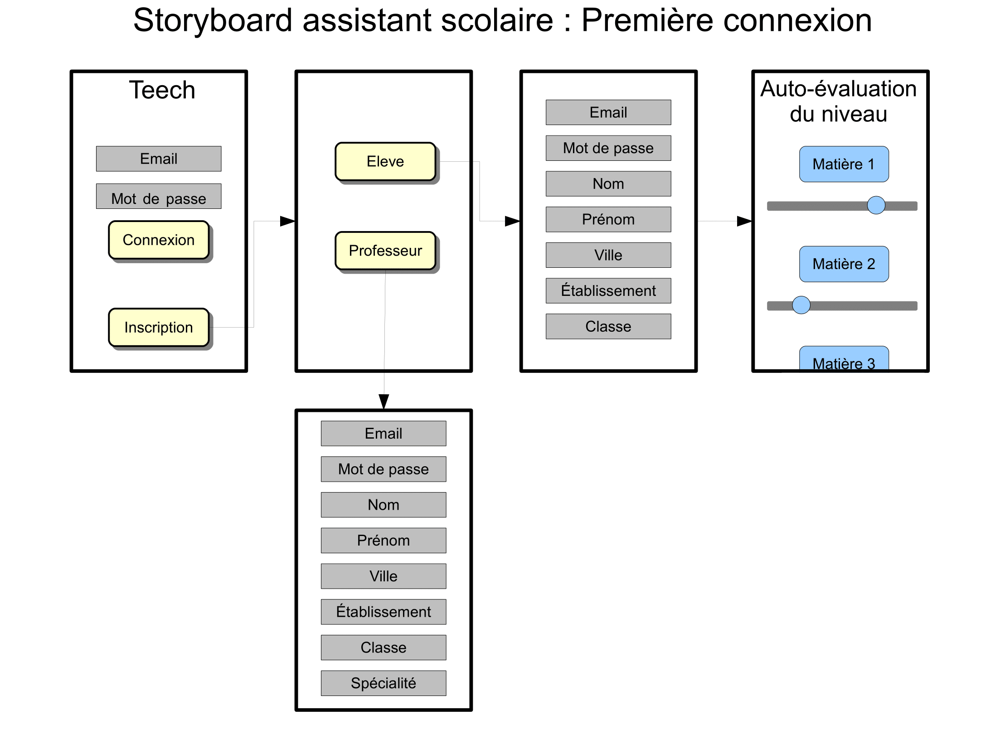
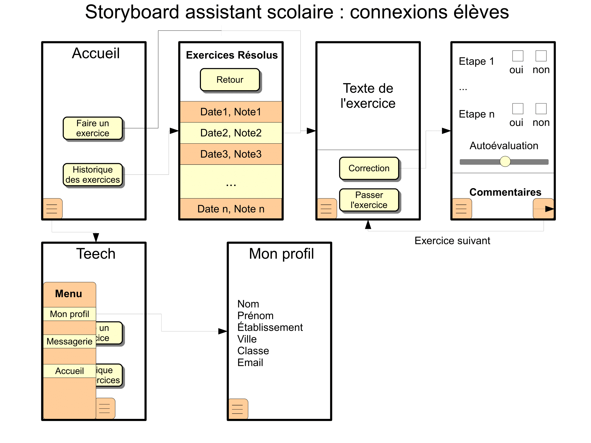
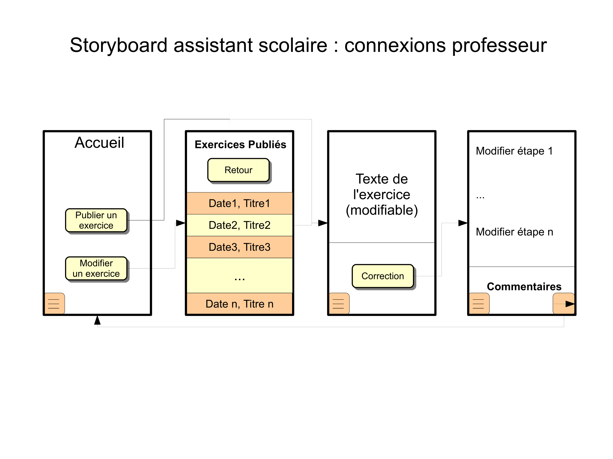

=== Interface utilisateur graphique

L'application s'ouvre sur une page d'authentification. Lors de la première
connexion, l'utilisateur a le choix entre se faire un profil élève ou
professeur. Il rentre ensuite ses informations personnelles, et s'autoévalue
dans les différents domaines si c'est un élève.

Lors des connexions suivantes, l'élève peut faire un exercice proposé par
l 'application ou accéder à ceux qu'il a déjà résolus. Une fois devant un
exercice, il peut le passer ou afficher la page de correction. Celle-ci propose
une résolution pas-à-pas de l'exercice. L'élève indique s'il a résolu les étapes
et s'attribue une note. Il peut aussi voir les commentaires des autres
utilisateurs concernant l'exercice. Il peut ensuite cliquer sur un bouton pour
passer à un nouvel exercice. Pendant toute l'utilisation, un bouton permet
d'afficher un menu contenant des liens vers la page d'accueil de l'application,
le profil de l'élève ou sa messagerie.

Le professeur a une vue similaire mais au lieu de résoudre des exercices il peut
en publier un nouveau ou modifier un exercice qu'il avait publié. Dans ce cas il
peut modifier le texte de l'énoncé et les étapes de résolution. Il a lui aussi
accès aux commentaires, afin de répondre aux éventuelles questions. Un bouton
affichant un menu identique à celui auquel ont accès les élèves est aussi
présent.