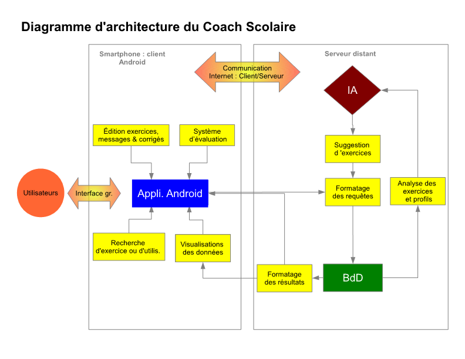

== Schéma d'architechture

== Description des blocs

    Les cases jaunes représentent les principales fonctions que l'on souhaite créer.
    Le sens des flèches symbolisent d'où elles reçoivent des données et où elles en envoient.

===== Application Android

L'application Android sera l'entité en interaction avec l'utilisateur. Elle sert d' "interprète" entre l'utilisateur et la base donnée et l'intelligence artificielle.

===== Intelligence articifielle

L'IA analyse les informations stockées dans la base de données afin de déterminer les exercices les plus pertinents pour faire progresser les utilisateurs.
Lorsqu'un utilisateur en exprimera le souhait via l'application, l'intelligence artificielle lui proposera les excercices les plus adaptés à son profil 
en se basant sur l'expérience qu'elle aura acquise à partir des données des autres utilisateurs. L'IA peut donc consulter la base de données et communiquer avec l'application Android. 

===== Base de données

La base de données stocke toutes les informations nécessaires au fonctionnement de l'application (les profils d'utilisateurs, les exercices, les corrigés, les messages etc.).
On inclus dans le bloc "base de données", un programme qui permet d'appliquer des requêtes SQL sur la base et d'en renvoyer le résultat sous une forme exploitable à l'intelligence artificielle ou à l'application en fonction des informations qu'elles réclament.

===== Interface Graphique

L'interface graphique permet l'usage simple de l'application à l'utilisateur. C'est l'outil qui modalise le dialogue entre les utilisateurs et l'application.

===== Communication : client/serveur 

Comme cela apparaît sur le diagramme, l'application sera localisée sur les appareils Android des utilsateurs tandis que l'IA et la base de données seront localisées sur machines capable de calcul plus puissant.
Il faut donc organiser la communication entre ces différentes entités.

===== Visualisation des données

Pour notre projet, le travail sur le module "visualisation des données" consistera à permettre aux utilisateurs de visualiser, de la manière la plus pertinente possible, les informations le concernant en particuliers son évolution dans les différentes matières.